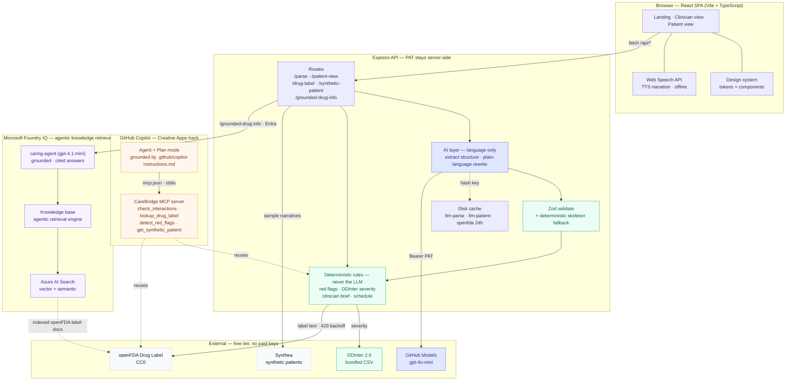
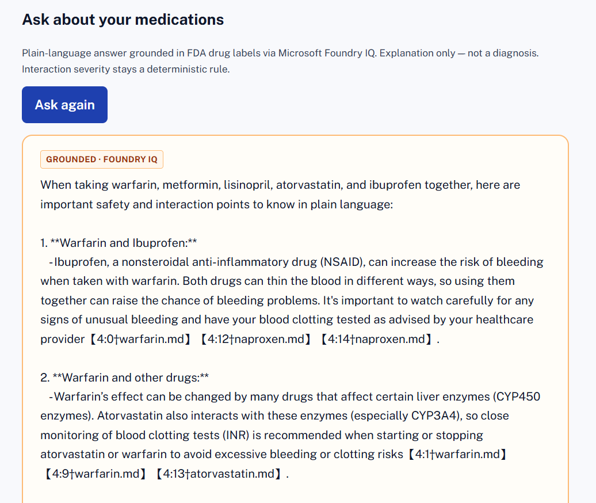
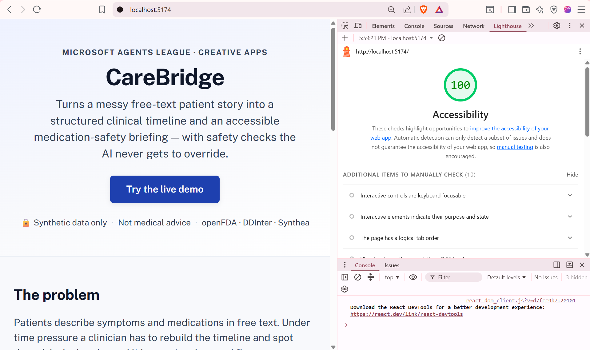
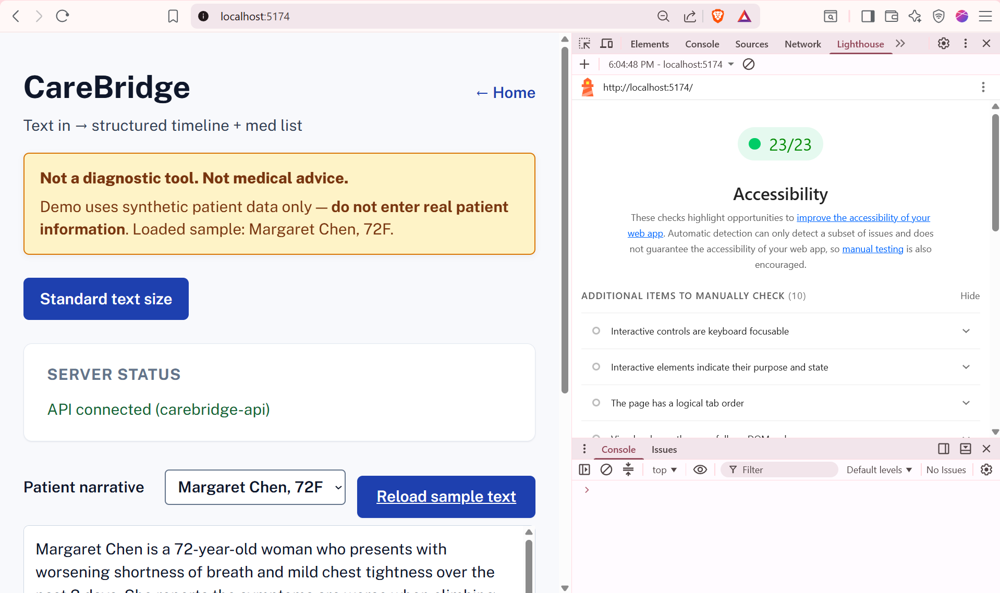

# CareBridge

Converts free-text patient narratives into a structured timeline and medication list.  
**Frontend:** Vite + React (port 5173) · **Backend:** Express API (port 3001)

## Architecture



**Legend** — 🟦 indigo = **AI / language only** (gpt-4o-mini: structure + rewrite) ·
🟩 green = **deterministic safety** (red flags + interaction severity, **never the LLM**) ·
🟧 orange = **GitHub Copilot + MCP** · 🟪 violet = **Microsoft Foundry IQ** (grounded, cited drug answers) ·
⬜ neutral = external data (CC0 / bundled / synthetic).

**How GitHub Copilot was used (Creative Apps track):** Plan + agent mode scaffolded the
app and were grounded on every request by `.github/copilot-instructions.md`; the
CareBridge **MCP server** exposes the four deterministic safety tools to Copilot agent
mode (config in `.vscode/mcp.json` / `.cursor/mcp.json`), reusing the same rule engine
the app does — so the agent and the product share one safety core.

**Microsoft IQ — Foundry IQ (required track integration).** The patient view's
*"Ask about your medications"* feature is grounded by **Microsoft Foundry IQ** —
agentic knowledge retrieval over the openFDA drug labels. The labels are exported
to Markdown (`npm run foundry:export` → `data/foundry-knowledge/`) and indexed into
a Foundry IQ **knowledge base** (Azure AI Search). A Foundry **agent**
(`caring-agent`) answers medication questions strictly from that knowledge base and
returns **cited** answers; the UI renders each source as a citation chip (e.g.
`warfarin.md`) under a `Grounded · Foundry IQ` provenance tag. Consistent with the
safety model, Foundry IQ produces *explanatory language only* — interaction
**severity** and **red-flag urgency** stay deterministic (DDInter + the rule engine)
and are never decided by retrieval. If Foundry IQ is disabled (`FOUNDRY_IQ` unset) or
unavailable, the server degrades to the deterministic cached FDA-label excerpt, so
the demo never hard-fails. Auth is Microsoft Entra via `az login` (server-side only);
see `.env.example` for `AZURE_AI_PROJECT_ENDPOINT` / `FOUNDRY_AGENT_NAME`.



> 📐 Static export for slides / portal upload: [`assets/architecture.png`](assets/architecture.png)

## Prerequisites

- Node.js 18+
- GitHub PAT with `models:read` (for LLM calls — server-side only)

```bash
cp .env.example .env
# Add your token: GITHUB_TOKEN=github_pat_...
```

## Install

```bash
npm install
```

## Start both (recommended)

Runs the React dev server and Express API together:

```bash
npm run dev
```

| Service  | URL                          |
|----------|------------------------------|
| Frontend | http://localhost:5173        |
| API      | http://localhost:3001/api    |

The Vite dev server proxies `/api/*` to Express, so the browser only needs port 5173.

## Start separately

**API only** (Express on :3001):

```bash
npm run dev:server
```

**Frontend only** (Vite on :5173 — needs API running for `/api` routes):

```bash
npm run dev:client
```

## Verify setup

Health check (API must be running):

```bash
curl http://localhost:3001/api/health
# → {"ok":true,"service":"carebridge-api"}
```

GitHub Models token (Phase 0 gate):

```bash
npm run test:token
```

## Build

```bash
npm run build    # client → dist/client/
npm run preview  # preview production build
```

## Responsible AI & safety

CareBridge is a **demo triage assistant**, not a clinical product.

- **Not a diagnostic tool. Not medical advice.** Output is for understanding and
  demo purposes only.
- **Synthetic data only** — never enter real patient information. The UI shows a
  persistent safety banner and blocks nothing, but the app is designed for bundled
  Synthea-style samples.
- **Provenance labels** — every field is tagged in the UI:
  - `AI-generated` — timeline, meds, symptoms, and plain-language patient cards
    from the LLM.
  - `Deterministic rule` + `ruleId` — red-flag urgency, DDInter interaction
    severity, follow-up questions, and safety cards. The LLM never sets these.
- **Graceful degradation** — on LLM failure, HTTP 429, or openFDA rate limits the
  app falls back to cache, skeleton/template parse, or rule-only data. Users see a
  plain-language warning banner; **stack traces are never shown** in the UI.
- **Caching** — see [LLM response cache](#llm-response-cache). Pre-warm demo
  narratives before judging live.

## Accessibility

Accessibility is a first-class feature, not an afterthought — CareBridge targets the
Agents League **Accessibility award**.

- **Audited with Lighthouse:** **100** on the landing page; **all automated checks
  passing** on the clinician and patient views (Snapshot mode).
- **Screen-reader narration** — per-card "Read this" plus "Narrate everything" via the
  browser Web Speech API (works offline with a local voice; long text is split for
  Chrome's utterance limit).
- **WCAG AA+ contrast** — patient-facing surfaces target ≥7:1; no meaning is conveyed
  by color alone (every severity / red-flag chip pairs color with a `!` glyph + text).
- **Larger-text mode**, full keyboard navigation with visible 3px focus rings, a skip
  link, semantic landmarks + heading hierarchy, `aria-live` status announcements, and
  `prefers-reduced-motion` support.

| Landing page | Clinician / patient app |
|---|---|
|  |  |

## Data sources & attribution

**Synthetic data only — never enter real patient information.**

- **Sample patient** (`data/synthea/`): four hand-authored synthetic narratives
  modeled on [MITRE Synthea](https://synthetichealth.github.io/synthea/)
  output. Not real Synthea exports and not real patient data.
- **Drug-interaction severity** (`data/ddinter/`): hand-curated demo subset
  informed by [DDInter 2.0](https://pubmed.ncbi.nlm.nih.gov/39180399/)
  (ATC B01AC + M01AE). Not the DDInter download — swap in the real export
  once its license is confirmed.
- Red-flag urgency and interaction severity come from deterministic rules
  and bundled lookups, never the LLM.
- **openFDA** drug label text (CC0): live lookup with 24h cache; stale cache used
  on HTTP 429. Attribution: "Data provided by the U.S. Food and Drug Administration."

## LLM response cache

Validated LLM parses are cached in `.cache/llm-parse/` keyed by
SHA-256 of `(prompt version | model | input text)`. Patient-view rewrites
live in `.cache/llm-patient/` keyed by `(patient prompt version | model |
story JSON)`. Re-parsing the same narrative hits cache and uses **zero**
GitHub Models quota.

### Pre-warm demo caches (run before judging live)

Four bundled Synthea-style narratives live in `data/synthea/`. Warm all
LLM + openFDA caches in one shot:

```bash
npm run test:token   # verify GITHUB_TOKEN first
npm run prewarm      # ~4 parse + 4 patient-view LLM calls (once)
```

Verify without calling the API:

```bash
npm run prewarm:check
```

After pre-warm, a live demo parse should show `source: llm-cache` in the
UI and touch no rate limit. Cache files stay in `.cache/` (gitignored) —
copy them to a demo machine or re-run `npm run prewarm` there.
